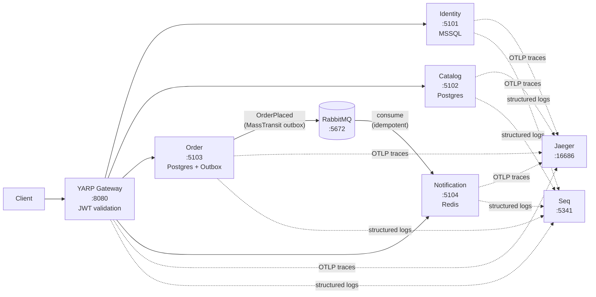

# Distributed Commerce Platform

An event-driven microservices platform built to demonstrate distributed-systems
patterns at the infrastructure level: async messaging with a transactional
outbox, distributed tracing across a message broker, polyglot persistence, and
gateway-edge auth. There is no frontend and no real business logic — this is a
thin but genuinely runnable vertical slice where every infrastructure pattern is
real. The optimization target is that a reviewer can run `docker compose up`,
exercise one end-to-end flow, and observe a single distributed trace crossing a
message broker in Jaeger.

---

## Architecture



The YARP gateway validates the JWT at the edge and routes by path prefix. Each
downstream service re-validates the JWT independently (defense in depth). The
Order service writes the order row and the `OrderPlaced` outbox message in one
Postgres transaction; MassTransit's outbox relay then publishes to RabbitMQ.
Notification consumes the event, deduplicates by OrderId, and writes to Redis.
All five processes export OpenTelemetry spans via OTLP, so a single trace ID
spans gateway → order → catalog (HTTP) → MassTransit publish → RabbitMQ →
notification consume — 12 spans across 4 services, visible in Jaeger.

---

## Polyglot Persistence

| Service      | Store              | Rationale |
|--------------|--------------------|-----------|
| Identity     | MSSQL (EF Core)    | Relational guarantees for the user store; MSSQL chosen explicitly to show heterogeneity — the catalog and order databases are Postgres, so no two adjacent services share a vendor. |
| Catalog      | Postgres (EF Core) | Relational schema for structured product data with EF Core migrations; Postgres preferred over MSSQL for the read-heavy catalog to demonstrate the per-service datastore principle. |
| Order        | Postgres (EF Core) | Transactional relational store required for the outbox pattern — MassTransit's EF outbox writes the event record and the order row in the same `SaveChanges` call; Postgres chosen for consistency with catalog and because the Npgsql provider has first-class outbox support. |
| Notification | Redis              | Notifications are ephemeral, per-user, and list-shaped. Redis `RPUSH`/`LRANGE` on a user key gives sub-millisecond reads and TTL-based expiry without a schema. No relational join is ever needed — a document/KV store is the right fit. |

---

## Key Design Decisions

### Transactional outbox (MassTransit EF outbox)

When Order places an order, it calls `IPublishEndpoint.Publish` and then
`SaveChangesAsync`. MassTransit intercepts the publish and writes the
`OrderPlaced` message to an outbox table in the *same* Postgres transaction as
the `Orders` row. A background relay process then reads the outbox and delivers
to RabbitMQ, marking the row delivered.

This means a process crash between the DB write and the broker publish cannot
lose the event or create a duplicate: the order and the intent to publish are
atomically committed together, and delivery is retried from the outbox until
acknowledged. Without the outbox, a crash in that gap produces a committed order
with no downstream notification — a silent data inconsistency invisible to the
caller.

### Idempotent consumer (Redis SET NX)

RabbitMQ delivers at-least-once. If a consumer crashes after writing to Redis
but before acknowledging the message, RabbitMQ redelivers. To prevent a second
notification being written, `NotificationStore.TryMarkProcessedAsync` does a
Redis `SET NX` on `notifications:processed:{orderId}` with a 7-day TTL. Only
the first call returns `true`; redeliveries short-circuit immediately. This is
the consumer-side counterpart to the publisher's outbox — together they give
effectively-once semantics end to end.

### MassTransit v8 (Apache-2.0) over v9 (commercial)

MassTransit v9 introduced a commercial license for the broker transport
packages. This repo uses v8, which is fully Apache-2.0 licensed, so the project
is freely runnable and forkable without a subscription. The same reasoning
applies to FluentAssertions, which is pinned to 7.2.0 (the last MIT-licensed
release).

### Gateway-edge JWT validation + defense in depth

YARP validates the JWT before forwarding any request to a downstream service.
Routes for `/products`, `/orders`, and `/notifications` have
`AuthorizationPolicy: default` set, so unauthenticated requests are rejected
with 401 at the gateway without touching a service. Each service also registers
`AddJwtBearer` and calls `RequireAuthorization()` on its own routes — the JWT is
validated twice. The redundancy is deliberate: a service exposed directly
(mis-configuration, sidecar, debugging) is still protected.

### OpenTelemetry context propagation across the broker

MassTransit v8 maintains an `ActivitySource` named `"MassTransit"`. The shared
`TelemetryExtensions.AddCommerceObservability` wires `.AddSource("MassTransit")`
into the OpenTelemetry tracer, so publish and consume activities are children of
the same root span. W3C `traceparent` is carried in the RabbitMQ message
headers. The result: a single trace in Jaeger spans HTTP, EF Core SQL, broker
publish, and broker consume without any manual instrumentation code.

---

## Run It

### Prerequisites

- [Docker Desktop](https://www.docker.com/products/docker-desktop/) (Engine 24+)
- .NET 10 SDK — only needed to run `dotnet test`; `docker compose up` builds
  without it

### Start the stack

```bash
docker compose up -d --build
```

This builds all five images and starts: MSSQL, two Postgres instances, RabbitMQ,
Redis, Jaeger, Seq, and the four services plus gateway (~90 seconds first run;
subsequent starts are faster because images are cached). Compose gates each
service on its datastore/broker being healthy (`depends_on: condition:
service_healthy`); the gateway starts after the four services' containers start
(container start, not health). Services apply EF Core migrations on startup and
expose `/health` for readiness.

### Golden-path walkthrough

The following commands exercise the complete flow. Copy and run them in order.
On Windows PowerShell use `curl.exe` or a REST client of your choice — the
canonical form below uses `curl` with `jq` for token extraction.

**1. Register a user**

```bash
curl -s -X POST http://localhost:8080/auth/register \
  -H "Content-Type: application/json" \
  -d '{"email":"a@b.com","password":"Passw0rd!"}' | jq .
```

Expected: `201 Created` with `{"id":"...","email":"a@b.com"}`.

**2. Log in and capture the token**

```bash
TOKEN=$(curl -s -X POST http://localhost:8080/auth/login \
  -H "Content-Type: application/json" \
  -d '{"email":"a@b.com","password":"Passw0rd!"}' | jq -r .accessToken)

echo $TOKEN   # confirm non-empty
```

**3. List products** (three seeded products are always present)

```bash
curl -s http://localhost:8080/products \
  -H "Authorization: Bearer $TOKEN" | jq .
```

Expected: array of 3 products — Mechanical Keyboard, USB-C Hub, 4K Monitor.

**4. Place an order**

```bash
curl -s -X POST http://localhost:8080/orders \
  -H "Authorization: Bearer $TOKEN" \
  -H "Content-Type: application/json" \
  -d '{"productId":"11111111-1111-1111-1111-111111111111","quantity":2}' | jq .
```

Expected: `201 Created` — `{"id":"<order-uuid>","totalPrice":258.00}`.

**5. Check the notification** (allow ~2 seconds for async consume)

```bash
sleep 2
curl -s http://localhost:8080/notifications/me \
  -H "Authorization: Bearer $TOKEN" | jq .
```

Expected: one notification — `"Order <uuid> confirmed: 2x Mechanical Keyboard ($258.00)."`.

---

## See It Work

### Jaeger — distributed trace

Open **http://localhost:16686**. Select service `order` in the search panel and
click Find Traces. Open the trace for `POST /orders`. You will see:

- An ASP.NET Core span for the HTTP request hitting the gateway, then order
- An EF Core span for the SQL insert
- An `HttpClient` span for the call from Order to Catalog (`GET /products/{id}`)
- A MassTransit `Send` span for publishing `OrderPlaced` to RabbitMQ
- A linked MassTransit `Receive` span in the `notification` service showing the
  consume side

All spans share the same trace ID — one distributed trace crossing two HTTP
hops and a message broker.

### Seq — correlated structured logs

Open **http://localhost:5341**. Copy the trace ID from Jaeger and enter it as a
filter: `TraceId = "<id>"`. You will see log entries from `order`, `catalog`,
and `notification` side by side, in time order, all tagged with the same trace
ID. The `TraceEnricher` in `Commerce.Shared` stamps every Serilog event with
`TraceId` and `SpanId` from `Activity.Current`.

### RabbitMQ management UI

Open **http://localhost:15672** (credentials: `guest` / `guest`). Under
Exchanges you will see the `Commerce.Shared.Contracts:OrderPlaced` fanout
exchange that MassTransit creates automatically. Under Queues you will see
`order-placed` with the Notification consumer bound to it, and
`order-placed_error` for dead-lettered messages.

---

## Tests

```bash
dotnet test
```

Requires Docker running. The test project uses **Testcontainers** to spin up
real MSSQL, Postgres (×2), RabbitMQ, and Redis in Docker containers for the
duration of the test run — no mocks, no fakes, no in-memory substitutes.

Five golden-path integration tests:

| Test | What it proves |
|------|---------------|
| `Login_returns_jwt` | Identity issues a valid JWT for correct credentials |
| `Order_without_auth_is_401` | JWT validation on the Order service endpoint |
| `Order_with_unknown_product_is_404` | Order validates the product via Catalog before persisting |
| `Valid_order_is_created` | Full order creation path: Catalog lookup → Postgres write → 201 |
| `Order_flows_through_broker_to_notification` | End-to-end: order → outbox → RabbitMQ → consumer → Redis → notification visible via API |

The end-to-end test polls for up to 10 seconds to allow for the async RabbitMQ
consume, then asserts the notification text contains "confirmed".

---

## Project Structure

```
Commerce/
├── Commerce.slnx
├── docker-compose.yml
├── .env                              # dev-only credentials (see Production Hardening)
│
├── gateway/
│   └── Commerce.Gateway/             # YARP reverse proxy, JWT validation, OTLP
│
├── services/
│   ├── Commerce.Identity/            # POST /auth/register, /auth/login → JWT; MSSQL
│   ├── Commerce.Catalog/             # GET /products, /products/{id}; Postgres + seed data
│   ├── Commerce.Order/               # POST /orders; Postgres + MassTransit outbox
│   └── Commerce.Notification/        # GET /notifications/me; Redis; RabbitMQ consumer
│
├── shared/
│   └── Commerce.Shared/
│       ├── Contracts/OrderPlaced.cs  # single source of truth for the event schema
│       ├── Observability/            # AddCommerceObservability(), UseCommerceSerilog(), TraceEnricher
│       ├── Auth/JwtAuthExtensions.cs # AddCommerceJwtAuth() — shared JWT validation
│       └── Errors/                   # RFC 7807 ProblemDetails exception handler
│
└── tests/
    └── Commerce.IntegrationTests/
        ├── CommerceStackFixture.cs   # Testcontainers: real infra + in-process WebApplicationFactory
        └── GoldenPathTests.cs        # 5 golden-path integration tests
```

---

## Production Hardening

The following tradeoffs were made deliberately to keep the demo to a single
`docker compose up`. Each one has a straightforward production remedy.

**Dev-only secrets committed to the repo.** The JWT signing key, database
passwords, and RabbitMQ credentials are in `appsettings.json` and `.env`, and
baked into the images at build time. In production, exclude `appsettings.json`
from the image (`.dockerignore`) and source secrets from a secrets manager
(Azure Key Vault, AWS Secrets Manager, HashiCorp Vault). Note that Compose
already overrides values via environment variables, and all service containers
already run as a non-root user (`USER app` in every Dockerfile) — so the
runtime surface is hardened even if the image contains dev credentials.

**`/auth/register` reveals whether an email is registered (HTTP 409).** A
targeted attacker can enumerate valid email addresses by registering addresses
and observing the response code. Production would use an email-confirmation flow
— always respond 202, send a verification email, and confirm via a token —
combined with rate limiting on the registration endpoint to prevent enumeration
at scale.

**`OrderPlaced` carries `UserEmail` in the message body.** This allows
Notification to avoid a synchronous call back to Identity, which is the
deliberate decoupling goal — but it means the broker message contains PII. Any
service or system that can read the exchange sees the email address. In
production, either pass only `UserId` and have Notification look up contact
details via an authorized internal API, or encrypt/scope the sensitive fields in
the event payload. The single-event design here is a proof-of-pattern; additional
events would need the same review.

**RabbitMQ uses `guest/guest` defaults.** The `guest` account is created by the
RabbitMQ image and has full administrative access. In production, create a
least-privilege broker account with explicit permissions scoped to the exchanges
and queues the service needs, and rotate credentials via the secrets manager.

### Real next steps

- **Kubernetes + service discovery.** Docker Compose DNS (`http://catalog:8080`)
  stands in for service discovery. In production: Kubernetes with DNS-based
  discovery, or Consul for multi-cluster/VM deployments. YARP routes would be
  driven by service-discovery configuration rather than static addresses.

- **Observability stack.** Jaeger (all-in-one) and Seq are excellent for
  development but are not production-grade at scale. Replace with Grafana Tempo
  (distributed traces), Loki (logs), and Prometheus + Grafana dashboards for
  metrics — all OTLP-compatible, so no changes to the instrumentation code are
  needed.

- **Schema migration pipeline.** Services call `MigrateAsync()` at startup —
  acceptable for a demo, fragile in production if multiple instances start
  simultaneously. Replace with a dedicated migration job (EF Core Migrations
  Bundle or Flyway) that runs as a Kubernetes init container or CI/CD step before
  the service rolls out.

- **Per-service repos and CI.** All services live in a monorepo here for ease of
  review. In production, each service would have its own repository, independent
  build pipeline, and container registry entry. The shared library would be
  distributed as a NuGet package.

---

## Extending the Pattern

The `OrderPlaced` flow — outbox publish in Order, idempotent consumer in
Notification — is the proof-of-pattern. Adding a second event (e.g.,
`OrderShipped`, `PaymentProcessed`) means: define the contract in
`Commerce.Shared/Contracts`, add a consumer in the relevant service, register it
with MassTransit. The outbox, dedup, retry, circuit breaker, and trace
propagation are wired once in the shared library and compose infrastructure —
every additional event inherits them for free.
